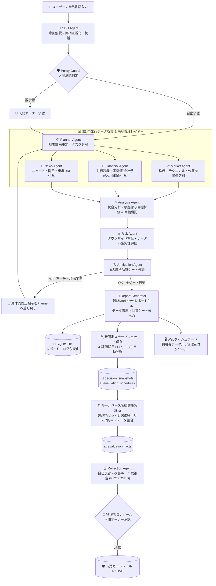
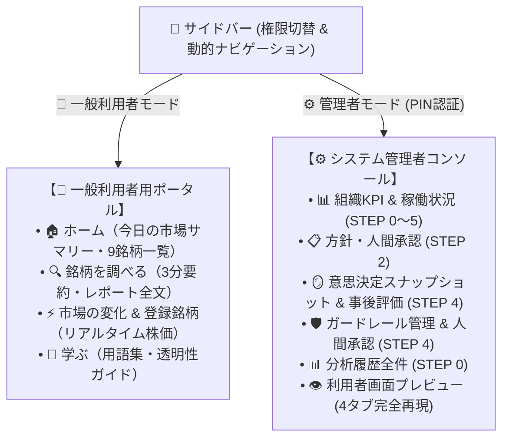

# 完全自律型マルチエージェント株価分析システム (Autonomous Multi-Agent Stock Research Platform)

[](https://www.python.org/)
[](https://github.com/langchain-ai/langgraph)
[](https://ai.google.dev/)
[](https://streamlit.io/)
[]()

> **「AI CEO」と8つの特化型エージェント部門が協調し、計画立案からデータ収集・批判的検証・6大品質ゲート・透明性開示・判断スナップショット固定・ルールベース事後事実評価・自己反省ガバナンスまでを自律実行するプロフェッショナル向け株式リサーチプラットフォーム**

---

## 📖 目次

1. [システム概要とビジョン](#1-システム概要とビジョン)
2. [全体システムアーキテクチャ](#2-全体システムアーキテクチャ)
3. [8大エージェントの役割と協調分業体制](#3-8大エージェントの役割と協調分業体制)
4. [段階的実装アーキテクチャ（STEP 0〜STEP 5）](#4-段階的実装アーキテクチャstep-0step-5)
5. [判断固定スナップショット ＆ ルールベース事後評価ガバナンス（STEP 4）](#5-判断固定スナップショット--ルールベース事後評価ガバナンスstep-4)
6. [マルチページ Web ダッシュボード構成（利用者用 vs 管理者用分離）](#6-マルチページ-web-ダッシュボード構成利用者用-vs-管理者用分離)
7. [高信頼性・6大厳格品質ゲート & データ透明性設計](#7-高信頼性6大厳格品質ゲート--データ透明性設計)
8. [クイックスタート & 実行手順](#8-クイックスタート--実行手順)
9. [プロジェクト構成](#9-プロジェクト構成)
10. [免責事項](#10-免責事項)

---

## 1. システム概要とビジョン

本システムは、大規模言語モデル（LLM）と複数の特化型サブエージェントを組み合わせ、機関投資家のアナリストチームのような厳格な分業体制によって**高精度かつ多角的な銘柄分析を完全自律で行う株価分析システム**です。

単一のプロンプトによる表面的な回答ではなく、
1. **リサーチ計画の策定**
2. **市場・財務・ニュースの3方向並行データ収集（実測値・推定値・参考値・欠損の厳格管理）**
3. **強気分析（ストラテジスト）と弱気批判（リスク管理）の対立討論**
4. **ファクトチェッカーによる「6大厳格品質ゲート」検証（OK/NG ループ）**
5. **`analysis_run_id` を主軸とした分析判断の固定保存（スナップショット）と評価期日（T+7, T+30）の自動登録**
6. **相対Alpha・仮説維持・リスク予見的中を測定する「ルールベース客観的事実評価」**
7. **改善ルール案（PROPOSED）の策定と人間オーナーによる承認ガバナンス（ACTIVE）**

に至る各工程を自律分散的に実行し、ハルシネーション（嘘の出力や架空数値の捏造・偏った買い煽り）を徹底的に排除した高信頼・高透明性の投資リサーチレポートを生成します。

---

## 2. 全体システムアーキテクチャ

本システムは **LangGraph** によるステートマシン（StateGraph）を採用し、エージェント間の協調と再帰的なフィードバックループを実現しています。



---

## 3. 8大エージェントの役割と協調分業体制

| エージェント名 | 担当領域 | 主な責務・タスク |
| :--- | :--- | :--- |
| **👑 CEO Agent**<br>(統括CEO) | 経営統括・要約 | • ユーザーからの自然言語リクエスト（「トヨタを調べて」等）を瞬時に正規化<br>• 全部門の成果物を総括し、歪みのない経営陣向けハイライト要約を生成 |
| **📋 Planner Agent**<br>(分析プランナー) | 戦略・計画策定 | • 対象銘柄に応じた調査観点（重点ポイント）を立案<br>• 各データ収集エージェントへ具体的タスクを発行<br>• Verification Agentからの差し戻し時に具体的欠陥を再調査計画へ反映 |
| **📈 Market Agent**<br>(市場・株価アナリスト) | 株価・テクニカル分析 | • 株価、出来高、移動平均線（SMA25/75）、RSI(14)、ボリンジャーバンド(2σ)を取得・数理計算<br>• 上値抵抗線・下値支持線について、実測値とルールベース代替参考値（BB・移動平均線）を明確に区別して言語化 |
| **🏢 Financial Agent**<br>(財務・業績アナリスト) | ファンダメンタルズ | • 時価総額、実績PER、予想PER、PBR、配当利回り、ROE、ROA、営業利益率、成長率の抽出<br>• 欠損時は「取得できませんでした（赤字のため算出対象外/データ未提供）」と理由を明示し、架空数値を捏造しない |
| **📰 News Agent**<br>(定性情報アナリスト) | 適時開示・市況ニュース | • 直近の開示情報や配信ニュースの見出し・本文を収集（**出典URL・公開日時を必ず紐付け**）<br>• 市場センチメント（強気/中立/弱気）およびスコア（1〜100点）を算定 |
| **💡 Analysis Agent**<br>(統合分析ストラテジスト) | 総合投資仮説の立案 | • 実測値・推定値・代替参考値・欠損状況を認識した上で総合投資仮説を立案<br>• **目標株価に具体的な計算根拠（EPS×PER、テクニカル上限等）を明記**<br>• **エグゼクティブサマリーに好材料とリスク・反論を必ず両論併記** |
| **⚠️ Risk Agent**<br>(リスク管理・反証役) | ダウンサイド・批判検証 | • 集中リスク、為替・金利リスク、業界競合リスクに加え、データ欠損・開示不確実性リスクを抽出<br>• Analysis Agentの強気仮説に対する客観的批判（Devil's Advocate）を提示 |
| **🔍 Verification Agent**<br>(品質保証・厳格ゲート) | 真の品質ゲートキーパー | • **6大厳格品質ゲート**（数値完全一致、ニュース出典URL、時点整合、目標株価根拠、事実解釈分離、両論併記）をプログラム決定論とLLMの2層で検証<br>• 基準未達時は **NG** でPlannerへ再調査指示 |
| **🪞 Reflection Agent**<br>(自己反省・自律学習) | ガバナンス・反省 | • 固定された判断スナップショットと事後評価客観事実を対比し、反省スコア・改善教訓を導出<br>• ガードレール改善規則案（`PROPOSED`）を策定（人間承認を経て有効化） |

---

## 4. 段階的実装アーキテクチャ（STEP 0〜STEP 5）

本システムは、段階的に拡張・発展可能なエンタープライズ設計となっています。

```text
STEP 0: 8部門協調 株価分析コアエンジン（Manager → Planner → Data → Analysis → Risk → Verification）
  ↓
STEP 1: AI CEO 統括レイヤー（自然言語正規化・委任・エグゼクティブサマリー）
  ↓
STEP 2: リサーチ方針決定 & Policy Guard（ResearchPolicy・人間承認フロー）
  ↓
STEP 3: 自律市場監視（Market Monitor・見守りスキャン・重複排除イベントトリアージ）
  ↓
STEP 4: 意思決定ジャーナル & 事後事実評価（Snapshot・Post-Evaluation・Reflection・Guardrails）
  ↓
STEP 5: 統合ダッシュボード & 資産化基盤（Streamlit Web UI・KPI集計・ResearchAsset）
```

---

## 5. 判断固定スナップショット ＆ ルールベース事後評価ガバナンス（STEP 4）

本システムは、単なる「当たった／外れた」の浅い検証ではなく、**「当時の前提条件・市場環境・事前指摘リスク・データ根拠」と「その後の客観的事実」を厳格に照合する事後検証・自己改善サイクル**を搭載しています。

### ① 判断固定スナップショットの保存（Snapshot）
* **キー**: `analysis_run_id`（一意な分析実行識別子）
* **固定内容**: 当時の株価、市場指数（日経225）、投資スタンス、総合評価スコア、目標株価の計算根拠、主要仮説一覧、事前指摘リスク一覧、データ欠損状態。後から「当時なぜそう判断したか」を100%再現可能なイミュータブルデータとして保存します。

### ② 評価対象日の自動登録（Schedule）
* レポート生成と同時に、**短期評価（`T+7`日後）** および **中期評価（`T+30`日後）** のスケジュールを自動生成。

### ③ ルールベース客観的事実評価（Deterministic Post-Evaluation）
LLMの主観を排除し、プログラム数理計算によって以下の4大項目を機械的に算出：
1. **市場指数対比の相対リターン（Alpha %）**: `銘柄騰落率 - 日経平均騰落率`（地合い連れ安と銘柄固有要因を分離）。
2. **主要仮説の維持状況**: 当時のスタンスに対して株価・業績前提が破綻していないかを照合。
3. **事前指摘リスクの予見的中度（Risk Foresight）**: 期間中に発生した市場急変イベントや下落要因が、**当時「identified_risks」に事前指摘されていたか**を照合。事前に警告できていれば「予見成功（高評価）」と判定。
4. **分析根拠のデータ完全性**: 当時の欠損有無と整合性をスコアリング。
5. **ルールベース事実スコア（0〜100点）**: 4項目を加重合算して客観的事実評価を確定。

### ④ Reflection Agent & ガバナンス承認フロー（PROPOSED → ACTIVE）
* **入力の限定**: Reflection Agent には「当時の判断スナップショット」と「計算された客観的事実データ」のみを入力。
* **提案ルールの承認制**:
  * AIが勝手にルールを有効化することは**一切ありません**。
  * 改善案は **`status='PROPOSED'`（提案中）** として登録され、管理者画面で人間オーナーが **`[✔ 承認して ACTIVE にする]`** を押すことで初めて有効化されます。

---

## 6. マルチページ Web ダッシュボード構成（利用者用 vs 管理者用分離）

Web UI（Streamlit）は、初心者ユーザーとシステム管理者（AI CEO/運用者）の役割を明確に分ける**「マルチページ ＋ 権限に応じたサイドバー動的ナビゲーション（Role-Based Dynamic Navigation）」**を採用しています。



### ① 【👤 一般利用者用ポータル（デフォルト）】
投資初心者が迷わず直感的に操作できるよう、**専門用語や管理UIを完全非表示化**したクリーンな画面です。
1. **🏠 ホーム（今日の市場）**:
   * 今日の市況サマリー（AI分析済み銘柄の種類数: 9銘柄 / 累計43回）、AI注目リサーチ、これまでにAIが分析した銘柄一覧、最新の重要変化速報、はじめてガイド。
2. **🔍 銘柄を調べる（3分要約 & 詳細レポート）**:
   * **即時プレビュー（Instant View）**: 会社名（「ソニー」「トヨタ」など）を入力した瞬間に待ち時間0秒で過去分析データを表示。
   * **🚀 最新データでAI調査を実行**: オンデマンドで8部門協調リサーチを完全自律実行（約18〜30秒）。
   * **好材料 vs 注意点カード**: 初心者向けに強みとリスクを色分けして分離表示。
   * **🛡 データ来歴・鮮度 & 欠損状況の開示**: 株価時点、財務時点、欠損有無のサマリーバッジを常時提示。
   * **詳しい分析レポート全文閲覧 & ダウンロード**: ブラウザ上でMarkdownレポートをアコーディオン展開して完全閲覧・ワンクリックダウンロード（`.md`）。
3. **⚡ 市場の変化 & 登録銘柄**:
   * **見守り銘柄のリアルタイム株価**: 登録銘柄の東証実測現在値、前日比（%）、設定アラート閾値をカード表示。
   * **ワンクリック市場見守りスキャン**: 全登録銘柄の急変検知・イベントトリアージを即時実行。
4. **📖 学ぶ（用語集・ガイド）**:
   * 「事実」と「AIの見方」の読み分け方、**【実測値】【推定値】【参考値】【取得できませんでした】の見分け方ガイド**、PER/PBR/ROE/配当利回りのやさしい解説、安全投資の3原則。

### ② 【⚙️ システム管理者コンソール（Admin / CEO）】
サイドバーの「⚙️ 管理者ログイン」（PIN認証: `admin`）から切り替える、一人社長・運用者専用の統括画面です。
1. **📊 組織KPI & 稼働状況**:
   * 分析済み銘柄数（9銘柄）、累計実施数、AI CEO統括回数、承認待ち方針数、自己反省精度スコア、蓄積ガードレール規則数の全メトリクス。
2. **📋 方針・人間承認 (STEP 2)**:
   * Policy Guard による人間オーナー事前承認・却下操作、新規リサーチ依頼の発行。
3. **🪞 意思決定スナップショット & 事後評価 (STEP 4)**:
   * 固定された判断スナップショット一覧、**ワンクリック事後評価ジョブ実行**、**客観的事実評価結果テーブル（相対Alpha・仮説維持・リスク的中・事実スコア）**、自己反省実行。
4. **🛡 ガードレール管理 & 人間承認 (STEP 4)**:
   * **承認待ちの改善ルール案（PROPOSED）のワンクリック承認（ACTIVE）／却下操作**、現在有効なルール一覧、人間フィードバック登録。
5. **📊 株価分析履歴全件 (STEP 0)**:
   * データベースに保存された全分析レコードテーブルの監査。
6. **👁 利用者画面プレビュー**:
   * 管理者モードのまま、一般利用者の全4画面（ホーム、調べる、市場変化、学ぶ）をタブ切り替えで完全プレビュー。

---

## 7. 高信頼性・6大厳格品質ゲート & データ透明性設計

### ① 6大厳格品質ゲート（Strict Fact Checking Quality Gate）
Verification Agent を単なる文章校正役ではなく、**「誤数値・根拠なし予想・偏った結論・架空ニュースを100%遮断する真の品質ゲート」** として実装しています。

| 検証項目 | 検証メカニズム | 検査内容 |
| :--- | :--- | :--- |
| **1. 元データ数値完全一致** | プログラム決定論的照合 | レポート内の株価・PER・PBR・前日比が元データと1円・1%の狂いもなく正確に一致しているか |
| **2. ニュース出典URL・日時** | 必須構造バリデーション | ニュース主張に有効な出典URLおよび公開日時が伴っているか（架空ニュース引用の完全排除） |
| **3. 数値時点の混在防止** | タイムスタンプ整合性検査 | 過去期の実績値と当期予想・直近株価が混同されず、時点が明示されているか |
| **4. 目標株価・シナリオ根拠** | パラメータ付随検査 | シナリオ株価に具体的な計算根拠（EPS×PER、テクニカル上限等）が明記されているか |
| **5. 事実とAI解釈の分離** | 文体・構造検査 | 確定実績（事実）とAIの推測・見解（意見）が明確に区別して記述されているか |
| **6. 好材料とリスクの両論併記** | バイアス検査 | 推奨結論（Buy等）に関わらず、好材料とダウンサイドリスク・反論・損切り基準が併記されているか |

### ② データ透明性ファースト設計（Data Lineage & No Hidden Missing）
従来の「無理やり穴埋めしてN/Aを隠す」設計を刷新し、**情報の出所と状態を完全に開示する高透明性アーキテクチャ**を採用しています。
* **値ステータスの厳密な区別 (`ValueStatus`)**:
  * **【実測値 (ACTUAL)】**: 取引所終値、確定有価証券報告書データ。
  * **【推定値 / 予想値 (ESTIMATED)】**: 会社予想PER、年間予想配当利回りなど。
  * **【代替値 / 参考値 (FALLBACK_RULE)】**: ボリンジャーバンドや移動平均線から算出した支持線・抵抗線など。
  * **【取得不可 / 欠損 (UNAVAILABLE)】**: 赤字のため算出対象外、またはデータ元未提供の項目。単なる `N/A` ではなく「取得できませんでした（理由）」を正直に開示。
* **レポート内の「データ品質・来歴情報 & 厳格品質ゲート検証」セクション**:
  * 全レポートの末尾に、株価データ時点（東証取引日）、財務決算期、ニュース件数、6大品質ゲート検査結果表、欠損項目・代替値一覧を完全出力。

### ④ 集中システムログファイル（ブラウザ非表示・自動ローテーション）
* **保存場所**: `logs/stock_analysis.log`
* **機能**:
  * ブラウザ画面上には表示せず、バックエンド（ファイルシステム）にのみ詳細な監査・実行ログを出力。
  * `RotatingFileHandler` により **最大 10MB × 5世代** の自動世代管理・容量制限に対応。
  * 6大品質ゲート検証、スナップショット固定、事後評価計算、APIレート制限（429リトライ）などの内部イベントをタイムスタンプ付きで詳細記録。

---

## 8. クイックスタート & 実行手順

### 前提条件
* Python 3.10 以上
* Google Gemini API キー（[Google AI Studio](https://aistudio.google.com/) で取得可能）

### 1. リポジトリのクローン & パッケージ導入
```powershell
git clone <repository_url>
cd 株価分析システム
pip install -r requirements.txt
```

### 2. 環境変数の設定 (`.env`)
`.env` ファイルを作成し、Gemini APIキーを設定します。
```env
GEMINI_API_KEY=AIzaSy...（あなたのAPIキー）
```

### 3. Web ダッシュボードの起動（推奨）
```powershell
python main.py --web
```
ブラウザで [http://localhost:8501](http://localhost:8501) にアクセスします。
* **一般利用者用**: そのまま4つのタブ（ホーム、銘柄を調べる、市場の変化、学ぶ）をご利用いただけます。
* **管理者用**: サイドバーの「⚙️ 管理者ログイン」から管理者モードに切り替えられます。

### 4. CLI（コマンドライン）での実行
```powershell
# トヨタ自動車 (7203) の単独分析
python main.py -t 7203

# ソニーグループ (6758) の分析
python main.py -t 6758

# 過去の分析履歴一覧を表示
python main.py --history
```

### 5. 自動テストの実行
```powershell
python -m pytest tests/ -v
```
※ 全35件の単体・結合・E2E・データ透明性・6大品質ゲート・事後評価・UIテストがすべてパスすることを確認できます。

---

## 9. プロジェクト構成

```text
株価分析システム/
├── src/
│   ├── agents/                     # 8大特化型エージェント群
│   │   ├── ceo_agent.py            # AI CEO（意図解釈・統括）
│   │   ├── planner_agent.py        # 分析計画・タスク分解
│   │   ├── market_agent.py         # 市場・株価・テクニカル分析（代替参考値区別）
│   │   ├── financial_agent.py      # 財務諸表・業績分析（欠損理由・予想値明示）
│   │   ├── news_agent.py           # ニュース・センチメント分析（出典URL・日時紐付け）
│   │   ├── analysis_agent.py       # 統合分析（計算根拠提示・両論併記）
│   │   ├── risk_agent.py           # リスク分析・批判的反証・開示不確実性評価
│   │   ├── verification_agent.py   # 6大厳格品質ゲート（2層ハイブリッド検証）
│   │   ├── reflection_agent.py     # 自己反省・改善ルール案策定 (PROPOSED)
│   │   └── policy_guard_agent.py   # 方針承認ガードレール
│   ├── contracts/                  # Pydantic データモデル定義 (DTO)
│   │   ├── data_lineage.py         # データ来歴・値ステータス・欠損モデル
│   │   ├── watch_item.py           # 監視対象・市場イベント・トリアージモデル
│   │   ├── ceo_request.py          # CEOリクエスト契約
│   │   ├── stock_analysis.py       # 分析部門リクエスト・レスポンス契約
│   │   ├── research_policy.py      # リサーチ方針契約
│   │   ├── decision_journal.py     # 判断スナップショット・事後評価・ガードレール契約
│   │   └── dashboard_metrics.py    # KPIメトリクス契約
│   ├── orchestration/              # LangGraph ワークフロー制御
│   │   ├── graph.py                # STEP 0 分析部門グラフ
│   │   └── ceo_graph.py            # STEP 1〜5 CEO統合オーケストレーション
│   ├── repositories/               # SQLite データアクセス層
│   │   ├── ceo_repository.py       # CEO履歴リポジトリ
│   │   ├── policy_repository.py    # 方針・承認リポジトリ
│   │   ├── monitor_repository.py   # 監視銘柄・市場イベントリポジトリ
│   │   └── governance_repository.py# スナップショット・事後評価・ガードレールリポジトリ
│   ├── services/                   # ビジネスロジック・サービス層
│   │   ├── snapshot_service.py     # 判断固定スナップショット & スケジュール登録サービス
│   │   ├── post_evaluation_service.py # ルールベース事後事実評価 & 定期評価ジョブサービス
│   │   ├── policy_service.py       # 方針策定・承認サービス
│   │   ├── watch_service.py        # 市場監視・見守りスキャンサービス
│   │   ├── journal_service.py      # 意思決定ジャーナル記録サービス
│   │   ├── feedback_service.py     # 人間フィードバック・ガードレール承認サービス
│   │   └── dashboard_service.py    # 統合KPI集計サービス
│   ├── tools/                      # 外部データ連携ツール群
│   │   ├── market_tools.py         # yfinance 株価・テクニカル指標算出
│   │   ├── financial_tools.py      # 財務指標・収益性データ（欠損理由・来歴付与）
│   │   └── news_tools.py           # 適時開示・市況ニュース取得（出典リンク・日時付与）
│   ├── ui/                         # UI補助モジュール
│   │   └── cli_dashboard.py        # Rich CLI ダッシュボード描画
│   ├── db.py                       # SQLite データベース初期化・レポート保存
│   ├── llm.py                      # Gemini API 設定 & safe_invoke_llm
│   ├── report.py                   # Markdownレポート整形 & 6大品質ゲート表出力
│   └── state.py                    # LangGraph 共有ステート定義 (厳格ゲート結果対応)
├── tests/                          # 自動テストスイート (pytest)
│   ├── unit/                       # 単体テスト群 (23件: 厳格品質ゲート・データ来歴・事後評価・UI)
│   └── integration/                # 結合・E2Eテスト群 (12件)
├── output/                         # 自動生成された Markdown 分析レポート (.md)
├── data/                           # SQLite データベース実体 (stock_analysis.db)
├── dashboard_app.py                # マルチページ & 権限動的ナビゲーション Web ダッシュボード
├── main.py                         # CLI & Web 統合エントリーポイント
├── requirements.txt                # 依存 Python パッケージ一覧
├── SYSTEM_OVERVIEW.md              # システム全体仕様書
├── AI_CEO_Stock_Research_STEP1_STEP5_Specification.md # STEP 1〜5 詳細設計書
├── Beginner_Friendly_Stock_Dashboard_UI_UX_Policy.md  # UI/UX 設計方針書
└── README.md                       # 本説明書
```

