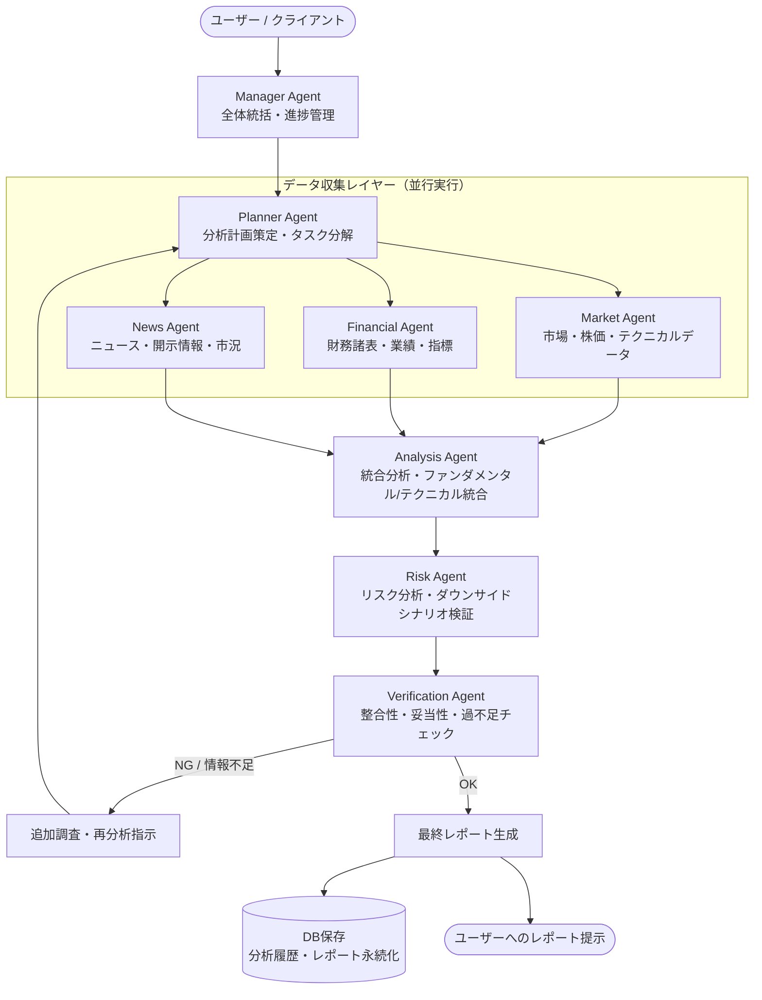

# 完全自律型マルチエージェント株価分析システム 仕様概要書

## 1. システム目的・ビジョン
本システムは、大規模言語モデル（LLM）と特化型サブエージェントを組み合わせ、専門職のアナリストチームのような分業体制によって**高精度かつ多角的な銘柄分析を完全自律で行う株価分析プラットフォーム**です。

単一のプロンプトによる分析ではなく、計画策定、データ収集（市場・財務・ニュース）、統合分析、リスク評価、ファクトチェック/品質検証、レポート出力、データベース永続化に至る各工程を専門エージェントが自律分散的に連携して実行します。

---

## 2. システムアーキテクチャ & 全体ワークフロー



---

## 3. 各エージェントの役割と責務 (Agent Roles & Specifications)

| エージェント名 | 担当領域 | 主な責務・タスク |
| :--- | :--- | :--- |
| **Manager Agent**<br>(統括マネージャー) | 全体オーケストレーション | • ユーザーからのリクエスト受領・意図解釈<br>• 全エージェントの進捗・状態監視<br>• エラーハンドリングおよび例外発生時のリカバリ制御 |
| **Planner Agent**<br>(分析プランナー) | 戦略・計画策定 | • 分析対象銘柄や市場環境に応じた調査計画の立案<br>• 各データ収集エージェントへの具体的タスク分解・発行<br>• Verification Agentからの差し戻し時の再調査計画の再設計 |
| **Market Agent**<br>(市場・株価アナリスト) | 市場データ収集・テクニカル分析 | • 株価データ（日足・週足・分足）、出来高の取得<br>• テクニカル指標（移動平均線、RSI、MACD、ボリンジャーバンド等）の計算・トレンド判定<br>• セクター・競合他社比較データの収集 |
| **Financial Agent**<br>(財務・業績アナリスト) | ファンダメンタルデータ収集 | • 決算短信、有価証券報告書データの抽出<br>• 主要財務指標（PER、PBR、ROE、ROA、自己資本比率、営業利益率等）の算出・推移分析<br>• 業績進捗率、コンセンサス予想比較 |
| **News Agent**<br>(ニュース・定性情報アナリスト) | 適時開示・定性情報・センチメント | • 直近ニュース、適時開示情報（TDnet等）、プレスリリースの取得<br>• 市場センチメント、業界トレンド、マクロ経済要因の抽出・要約<br>• 経営陣の動向、新製品・新サービスの反響確認 |
| **Analysis Agent**<br>(統合分析ストラテジスト) | クロスデータ統合・投資仮説立案 | • 収集された定量（市場・財務）と定性（ニュース）データの突合・因果関係の分析<br>• 割安度、成長性、モメンタムを総合した投資仮説の立案<br>• 短期・中期・長期の株価シナリオ策定 |
| **Risk Agent**<br>(リスク管理スペシャリスト) | ダウンサイド検証・リスク抽出 | • 下落リスク要因（金利・為替感応度、業績下方修正懸念、競合脅威等）の特定<br>• 最大ドローダウン想定やボラティリティリスクの評価<br>• Analysis Agentの強気仮説に対する客観的批判的検証（Devil's Advocate） |
| **Verification Agent**<br>(品質保証・ファクトチェッカー) | 妥当性検証・ゲートキーパー | • 出力結果の数値整合性、ファクトチェック（ハルシネーションの排除）<br>• 分析の網羅性・情報過不足判定<br>• 品質基準に達しない場合の追加調査トリガー発出 |

---

## 4. 自律的検証とフィードバックループ (Autonomous Feedback Loop)

本システムの最大の特徴は、**Verification Agentによる自動品質ゲートと再帰的なフィードバック機構**にあります。

### 検証判定フロー
1. **整合性・完全性チェック**:
   - 必須データ（財務指標、直近株価トレンド、最新開示）が欠落していないか
   - Analysis Agentの主張とRisk Agentの指摘に論理的矛盾がないか
   - 数値データソースと分析本文の引用数値が一致しているか
2. **判定結果**:
   - **OK**: 最終レポート生成フェーズへ移行。
   - **NG / 情報不足**:
     - 不足点（例：「直近の開示情報の反映漏れ」「競合比較データの不足」など）を明確化した調査要求を生成。
     - **Planner Agent** へフィードバックし、ピンポイントな追加調査・再分析を実行。

---

## 5. 出力とデータ永続化 (Output & Data Persistence)

### 最終レポート構成
- **エグゼクティブ・サマリー**: 投資判断サマリー、総合評価スコア、主要カタリスト
- **ファンダメンタルズ分析**: 財務健全性、成長性、収益性評価
- **テクニカル・市場分析**: トレンド分析、サポート/レジスタンスライン、出来高分析
- **定性・ニュース分析**: 業績ドライバ、直近トピックス、センチメント評価
- **リスク分析 & ダウンサイドシナリオ**: 主なリスク要因、想定シナリオ、損切り・注視ライン
- **総合投資戦略 & アクションプラン**: 想定保有期間別スタンス

### DB保存仕様
- **分析履歴テーブル**: 銘柄コード、分析日時、総合スコア、レポートID
- **データスナップショット**: 取得時の生データ（株価、財務、ニュース要約）
- **エージェントログ**: 各エージェントの思考プロセス、検証判定履歴、フィードバック回数

---

## 6. システムの強み・優位性
1. **完全自律性**: 単一の指示から最終レポート・DB保存まで人間の介入なしに完結。
2. **多角的・客観的な分析**: 強気分析（Analysis）とリスク分析（Risk）を別エージェントに分けることで確証バイアスを排除。
3. **高品質・高信頼性**: Verification Agentによる厳格なファクトチェックと不足情報の自動再取得により、LLM特有のハルシネーションを極小化。

---

## 7. Gemini API による実装実現性の検討 (Feasibility Study)

### 結論
**Gemini API を用いて本システムを完全に実装可能です。**  
むしろ、Geminiが持つ「超長コンテキスト」「ネイティブ・マルチモーダル」「Google Search Grounding」「構造化出力（Structured Outputs）」などの強みは、本マルチエージェント株価分析システムの要件と極めて高い親和性を持っています。

### Gemini API が本システムに最適である理由

| Gemini API の強み・機能 | 本システムにおける具体的活用領域 |
| :--- | :--- |
| **超長コンテキスト (1M〜2M+ tokens)** | 数十〜数百ページに及ぶ**有価証券報告書、決算説明会資料（PDF/テキスト）、複数年分の時系列データ**を丸ごとコンテキストに投入して網羅的・長期的なファンダメンタルズ分析が可能（Financial Agent / Analysis Agent）。 |
| **ネイティブ・マルチモーダル対応** | 生成・描画された**テクニカルチャート画像（ローソク足、移動平均、ボリンジャーバンド等）**や決算スライド図表を直接視覚的に解析（Market Agent / Financial Agent）。 |
| **Google Search Grounding (検索連携)** | 最新の市況ニュース、適時開示、突発的な市場イベントをリアルタイムに検索・出典付きで取得（News Agent）。 |
| **Structured Outputs (JSON Mode / Schema)** | エージェント間通信プロトコルや、Verification Agent の「OK / NG判定 + 不足要素リスト」を**厳格なJSONスキーマで出力**し、自律ループの制御を堅牢化。 |
| **Function Calling (Tool Use)** | `yfinance`、`EDINET API`、`J-Quants`、データベース操作などのPython関数をエージェントから自然に自律呼び出し可能。 |
| **モデル階層化 (Model Tiering)** | 高速・低コストな `Gemini Flash` と、高度推論・長文読解に長けた `Gemini Pro` を役割ごとに使い分け、分析速度とコスト効率を最大化。 |

---

### エージェント別 Gemini API 適用マップ

```mermaid
flowchart LR
    subgraph Orches [オーケストレーション & 推論 (Gemini Pro)]
        Manager[Manager Agent]
        Planner[Planner Agent]
        Analysis[Analysis Agent]
        Risk[Risk Agent]
        Verification[Verification Agent]
    end

    subgraph FastAgents [並行データ収集 (Gemini Flash + Tools)]
        Market[Market Agent<br/>+ yfinance / Chart Image]
        Financial[Financial Agent<br/>+ EDINET / PDF Parser]
        News[News Agent<br/>+ Search Grounding]
    end

    Planner --> FastAgents
    FastAgents --> Analysis
    Analysis --> Risk --> Verification
```

| エージェント | 推奨モデル | 活用する Gemini API 機能 / 外部ツール |
| :--- | :--- | :--- |
| **Manager Agent** | Gemini Pro | Function Calling, Structured Output（ステート管理） |
| **Planner Agent** | Gemini Pro | 構造化計画生成（Pydantic Schema出力） |
| **Market Agent** | Gemini Flash | Function Calling (`yfinance`), マルチモーダル（チャート画像解析） |
| **Financial Agent** | Gemini Flash / Pro | ドキュメント理解（決算PDF直読）, Function Calling (`EDINET API`) |
| **News Agent** | Gemini Flash | **Google Search Grounding**, センチメント分析 |
| **Analysis Agent** | Gemini Pro | 超長コンテキスト統合推論, シナリオモデリング |
| **Risk Agent** | Gemini Pro (Thinking) | 批判的推論, リスクマトリクス生成 |
| **Verification Agent** | Gemini Pro | Structured Output (`{"status": "OK"|"NG", "missing_points": [...]}`) |

---

### 推奨技術スタック & 実装アーキテクチャ

1. **エージェント・オーケストレーション**:
   - `LangGraph` または `Google GenAI SDK` (Python)
   - 状態管理（StateGraph）を用いた循環フィードバックループ（Verification $\rightarrow$ Planner）の実装
2. **データソース & ツール連携**:
   - 株価・テクニカル: `yfinance`, `pandas-ta`, `mplfinance`
   - 財務データ: `EDINET API` / `EDINET-py` / PDF解析
   - ニュース: Gemini 内蔵 Google Search Grounding または News API
3. **データ永続化**:
   - `SQLite` (ローカル軽量DB) または `PostgreSQL` (リレーショナル永続化)
   - 分析結果レポート（Markdown / JSON）の保存

---

## 8. 実装ディレクトリ構成 & 実行手順 (Quick Start)

### ディレクトリ構成
```text
株価分析システム/
├── src/
│   ├── agents/                     # 特化型エージェント群
│   │   ├── __init__.py
│   │   ├── planner_agent.py        # 分析計画・再調査計画策定
│   │   ├── market_agent.py         # 市場・株価・テクニカル分析
│   │   ├── financial_agent.py      # 財務・ファンダメンタルズ分析
│   │   ├── news_agent.py           # ニュース・センチメント分析
│   │   ├── analysis_agent.py       # 統合分析・投資シナリオ立案
│   │   ├── risk_agent.py           # ダウンサイドリスク・批判的検証
│   │   └── verification_agent.py   # 品質判定・過不足チェック
│   ├── tools/                      # データ取得ツール群
│   │   ├── market_tools.py         # yfinance 株価・テクニカル指標
│   │   ├── financial_tools.py      # 財務指標・収益性データ
│   │   └── news_tools.py           # ニュース・開示情報取得
│   ├── state.py                    # LangGraph 共有ステート定義
│   ├── llm.py                      # Gemini API モデル設定 (Flash / Pro)
│   ├── db.py                       # SQLite 永続化層
│   ├── graph.py                    # LangGraph ワークフロー (フィードバックループ)
│   └── report.py                   # Markdownレポート整形 & DB保存
├── output/                         # 自動生成された最終レポート保存先
├── data/                           # SQLiteデータベース保存先 (stock_analysis.db)
├── requirements.txt                # 必要パッケージ
├── .env.example                    # 環境変数テンプレート
├── .env                            # APIキー設定ファイル (要作成)
├── main.py                         # CLIエントリーポイント
├── kabu.txt                        # システム要件定義
└── SYSTEM_OVERVIEW.md              # 本仕様書
```

### セットアップ & 実行手順

#### 1. 依存パッケージのインストール
```powershell
pip install -r requirements.txt
```

#### 2. 環境変数の設定 (`.env`)
`.env` ファイルを作成し、ご自身の Gemini API キーを設定します。
```env
GEMINI_API_KEY=AIzaSy...（あなたのGemini APIキー）
```

#### 3. 分析の実行 (CLI)
日本株の4桁銘柄コード（または `.T` 付き）を指定して実行します。
```powershell
# 例: トヨタ自動車 (7203) の分析
python main.py -t 7203

# 例: ソフトバンクグループ (9984) の分析
python main.py -t 9984
```

#### 4. 過去の分析履歴の確認
```powershell
python main.py --history
```


